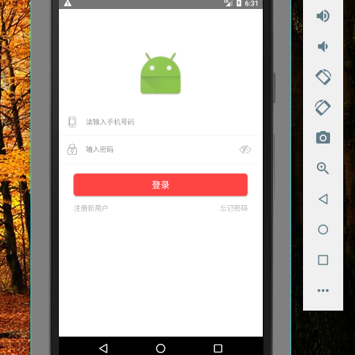
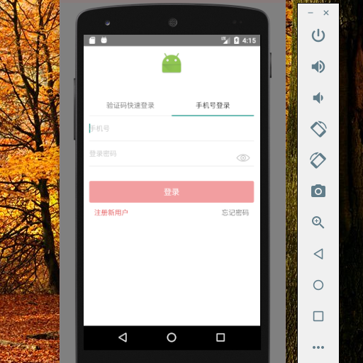
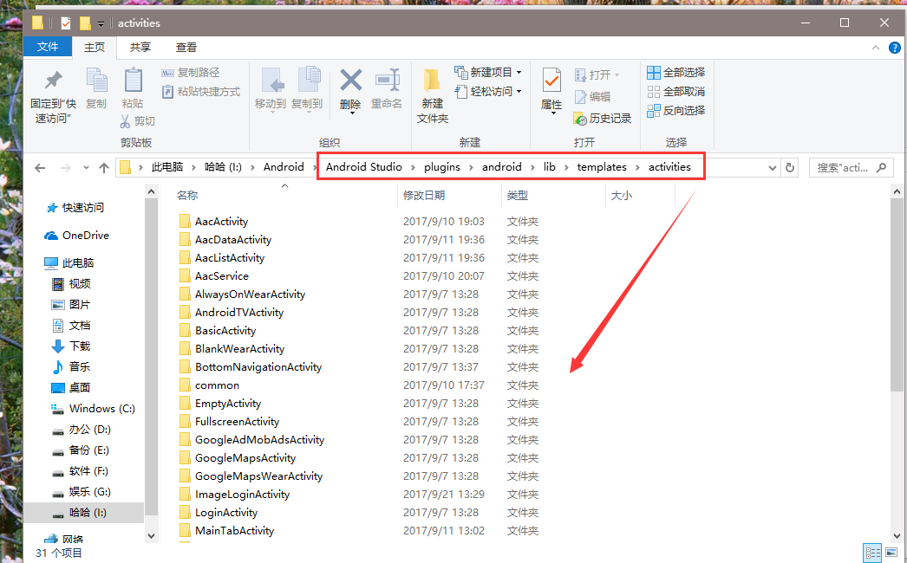
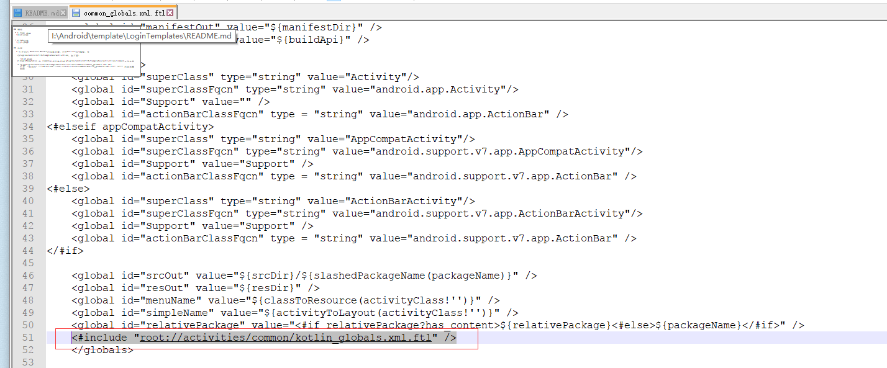
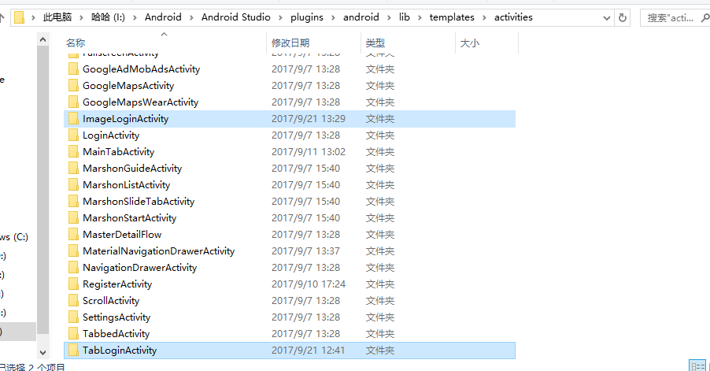
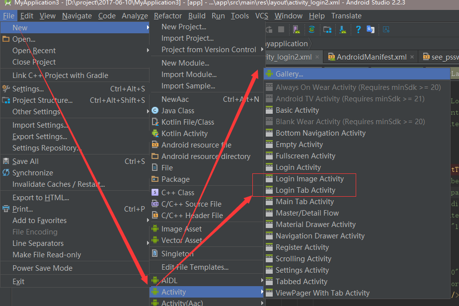

# LpginTemplates
logo 缩放，验证码和密码登录tab切换 登录模板 支持java和Kotlin

## 预览

 * 1.logo 缩放
  
  

 * 2.tab切换
  

## 使用

  1.打开你的 Android Studio的安装目录，对于Activity的模板，在

   **/plugins/android/lib/templates/activities**，如下图:
   
   
	 
   2.LoginTemplates 的 common的问价拷贝到**plugins/android/lib/templates/activities/common**文件夹里	 
   
   3.找到**plugins/android/lib/templates/activities/common/common_globals.xml.ftl**
     打开  "然后将" **"<#include "root://activities/common/kotlin_globals.xml.ftl" />"** 内容末尾
	 
   如图
     
   
   4.LoginTemplates 的 ImageLoginActivity和TabLoginActivity 拷贝到 **plugins/android/lib/templates/activities/**目录
   
   如图
   
   
   5.重启您android  Studio 找到你刚刚导入模板   如图
   
   
   6 你就可以愉快快速创建登录页面
      
  
  
### >注意： 选择 "kotlin"   android studio3.0以上版本使用